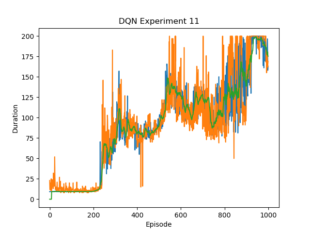
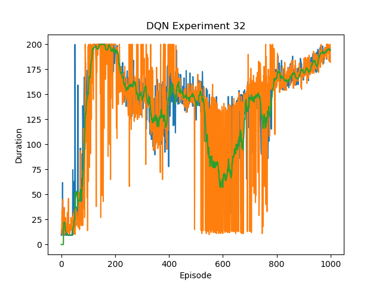
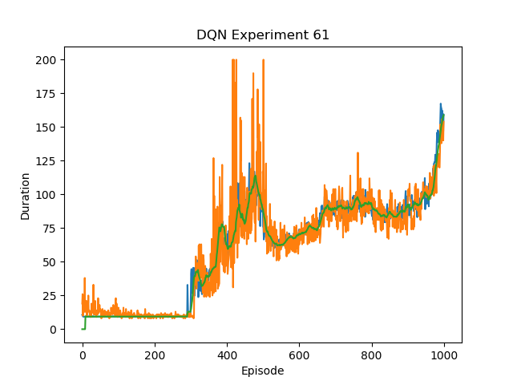
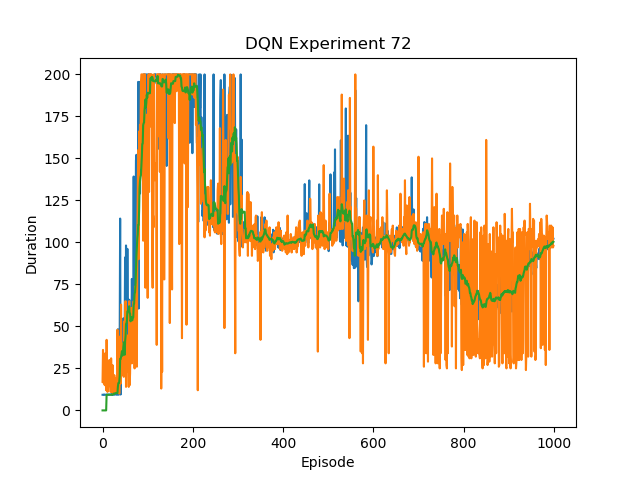
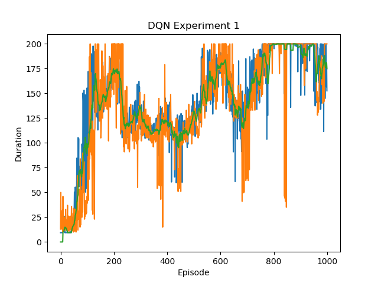
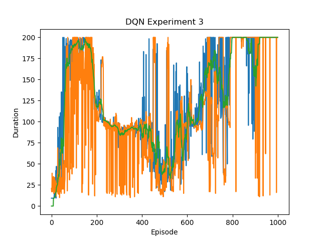
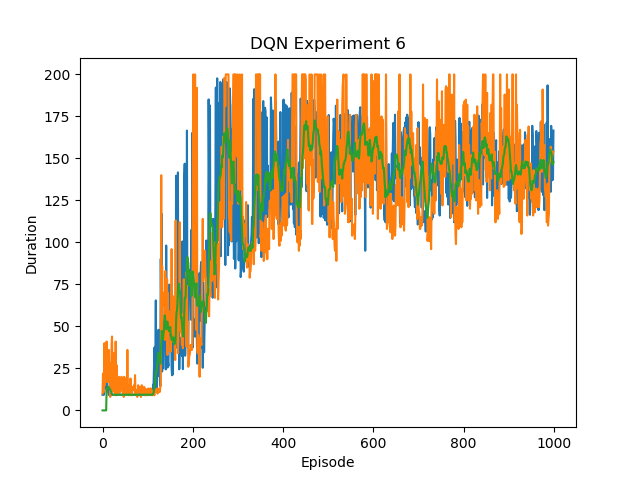
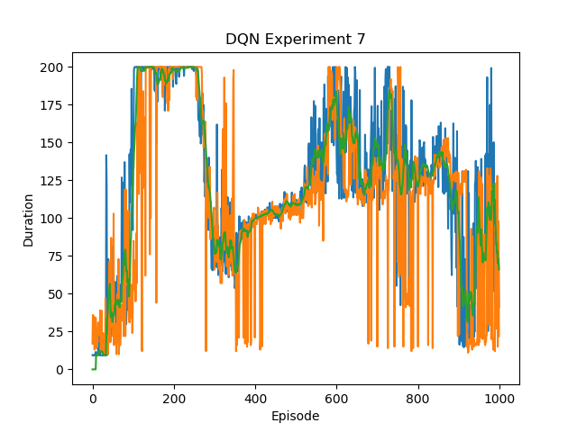
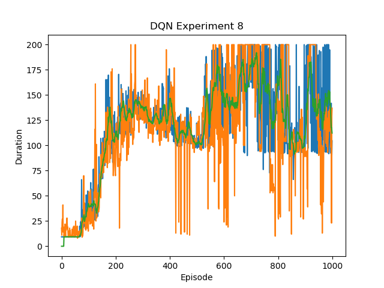

# Deep Q-Learning in PyTorch

This is a repository of DQN and its variants implementation in PyTorch based on the original papar.

## Algorithms

Algorithms below will be implemented in this repository.

**Deep Q Network (DQN)** from Playing Atari with Deep Reinforcement Learning, Mnih et al, 2013. [[arxiv](https://arxiv.org/abs/1312.5602v1)] [[summary](https://github.com/RPC2/DRL_paper_summary/blob/master/01%20Model-Free%20RL/001%20Playing%20Atari%20with%20Deep%20Reinforcement%20Learning.md)]

**Double DQN** Deep Reinforcement Learning with Double Q-learning, Hasselt et al 2015. [[arxiv](https://arxiv.org/abs/1509.06461)] [[summary](https://github.com/RPC2/DRL_paper_summary/blob/master/01%20Model-Free%20RL/004%20Deep%20Reinforcement%20Learning%20with%20Double%20Q-learning.md)]

**Dueling DQN** Dueling Network Architectures for Deep Reinforcement Learning, Wang et al, 2015. [[arxiv](https://arxiv.org/abs/1511.06581)] [[summary](https://github.com/RPC2/DRL_paper_summary/blob/master/01%20Model-Free%20RL/003%20Dueling%20Network%20Architectures%20for%20Deep%20Reinforcement%20Learning.md)]

**Prioritized Experience Replay (PER)** Prioritized Experience Replay, Schaul et al, 2015.  [[arxiv](https://arxiv.org/abs/1511.05952)] [[summary](https://github.com/RPC2/DRL_paper_summary/blob/master/01%20Model-Free%20RL/005%20Prioritized%20Experience%20Replay.md)]

## Methods

### DQN

The Q-network I use here is 3-hidden-layer perceptrons(MLP). The hidden_size is 32. The option of **dueling network** is also included. **Double** and **PER** are implemented in the agent codes.

The corresponding policy action is generated by -greedy method. is exponentially decayed w.r.t. a designated decay rate.

When evaluating the performance of the model, I wrote a class method called `demo`. `demo` basically plays the game for 100 times by exploiting the actions generated by the policy network (equivalent to  = 1.0), and get the average score of the games as the score of the current policy network.

The policy network scores, and average scores of the past 10 versions of policy network, as well as the current episode duration are plotted in the result.png.

#### Dueling Network


```python
class DQN(nn.Module):

    def __init__(self, num_actions, input_size, hidden_size, dueling = False):
        super(DQN, self).__init__()
        self.num_actions = num_actions
        self.fc1 = nn.Linear(input_size, hidden_size)
        self.fc2 = nn.Linear(hidden_size, hidden_size)

        self.dueling = dueling
        if dueling:
            self.fc_value = nn.Linear(hidden_size, 1)
            self.fc_actions = nn.Linear(hidden_size, num_actions)
        else:
            self.fc3 = nn.Linear(hidden_size, self.num_actions)
    
    # Called with either one element to determine next action, or a batch
    # during optimization. Returns tensor([[left0exp,right0exp]...]).
    def forward(self, x):
        x = x.view(x.size(0),-1)
        if not self.dueling:
            x = F.relu(self.fc1(x))
            x = F.relu(self.fc2(x))
            x = self.fc3(x)
        else:
          	# dueling network
            x = F.relu(self.fc1(x))
            x = F.relu(self.fc2(x))
            v = self.fc_value(x)
            a = self.fc_actions(x)
            x = a.add(v - a.mean(dim=-1).unsqueeze(-1))
        return x
```

#### Double Q-Learning

- See the function `Agent._optimize_model()` in `agent.py` [code](https://github.com/kmdanielduan/DQN_Family_PyTorch/blob/master/agent.py) and [summary](https://github.com/RPC2/DRL_paper_summary/blob/master/01%20Model-Free%20RL/004%20Deep%20Reinforcement%20Learning%20with%20Double%20Q-learning.md).

#### Prioritized Experience Replay

```python
if self.PER:
            batch_idx, transitions, glNorm_ISWeights = self.memory.sample(self.BATCH_SIZE)   
        else:
        		transitions = self.memory.sample(self.BATCH_SIZE)

if self.PER:
        # Compute abs TD error
        abs_errors = t.detach()
        abs_errors_ = abs_errors.numpy() 
        # Update the priority level
        self.memory.batch_update(batch_idx, abs_errors_)
        # accumulate weight-change
        losses = losses * torch.from_numpy(glNorm_ISWeights).reshape(self.BATCH_SIZE,-1) #* abs_errors
```

## Experiments and Results

```python
# typical hyperparameters
class AgentConfig:
    EXPERIMENT_NO = 99

    START_EPISODE = 0
    NUM_EPISODES = 500
    MEMORY_CAPA = 50000
    MAX_EPS = 1.0
    MIN_EPS = 0.01
    UPDATE_FREQ = 10
    DEMO_NUM = 100
    
    LR = 5e-4          # learning rate
    LR_STEP_SIZE = 9999 # learning rate step size
    DECAY_RATE = 0.99   # decay rate
    BATCH_SIZE = 32     # batch size
    GAMMA = 0.99        # gamma

    ALPHA = 0.6         # alpha for PER
    BETA = 0.4          # beta for PER

    DOUBLE = False      # double Q-learning
    DUELING = False     # dueling network
    PER = False         # prioritized replay

    RES_PATH = './experiments/'

class EnvConfig:
    ENV = "CartPole-v0"
```

Below are the experiments to test DQN under different circumstances. In the plot,

*Blue line:* policy network scores

*Orange line:* the current episode score under greedy policy

*Green line:* average scores of the past 10 versions of policy network

### Integrated Agent — Ablation Study
| No.  | learning rate |  double   | dueling |    PER    | result.png                       | Comments                                                     |
| :--: | :-----------: | :-------: | :-----: | :-------: | -------------------------------- | ------------------------------------------------------------ |
|  11  |     25e-5     |   False   |   False    |   False    |  | High variance in training, but making stable progress. |
|  21   |   25e-5    |  **True** |   False    |   False    |  | Double Q-learning decreases abrupt performance degradation. |
|  32   |   5e-4(step:200)    |   False    |  **True** |   False    |  | Deuling network seems to make it worse :) |
|  42  | 5e-4(step:200) |   False    | False  |  **True** |  | PER makes the network boost to high performance quickly, but followed by huge degradation. |
|  51   |     25e-5      |   False    | **True** |  **True** |  | The performance was maintained on a high level after 770 episodes, but constantly harmed by variance. |
|  61   |     25e-5      |  **True** |  False  |  **True** |  | The training seems more stable, but takes longer to get to high performance. |
|  72   |     5e-4(step:200)      |  **True** |  **True** | False |  | The agent achieved high performance at 100 episodes, but quickly degrades after that. |
|  81   |     25e-5      |  **True** |  **True** |  **True**  |  | Relatively steady growth, but high variance when training. |

### Augmented Integrated Agent

- In additional to the settings above, the augmented integrated agent also has the following settings:
  - Environment: **"CartPole-v1"**
  - The loss function(after accumulating weight change) will be multiplied with `abs_errors` in order to further scale up the gradients of the prioritized transitions 
  - The greedy actions were sampled by the target net, with the hope to stablize the training.

| No.  | learning rate |  double   | dueling |    PER    | result.png                       | Comments                                                     |
| :--: | :-----------: | :-------: | :-----: | :-------: | -------------------------------- | ------------------------------------------------------------ |
|  91  |     5e-4(step: 400)     |   True    |   True    |  True    |  | Solved the game after 1050 episodes. |


### DQN

| No.  | learning rate | decay rate | batch size |   gamma   | result.png                       | Comments                                                     |
| :--: | :-----------: | :--------: | :--------: | :-------: | -------------------------------- | ------------------------------------------------------------ |
|  1   |     5e-4      |    0.99    |     32     |   0.99    |  | Solved the game after around 800 episodes.                   |
|  2   |   **1e-4**    |    0.99    |     32     |   0.99    |  | Small learning rate makes the network hard to learn anything. Not converging at all. |
|  3   |   **1e-3**    |    0.99    |     32     |   0.99    |  | Solved the game after around 200 episodes. Displayed a pattern of high probability of divergence due to high learning rate. |
|  4   |     5e-4      |    0.99    |   **64**   |   0.99    |  | Bigger batch size counter-intuitively leads to worse performance. |
|  5   |     5e-4      |    0.99    |   **16**   |   0.99    |  | Smaller batch size makes the  policy stay in high performance but much more noise. |
|  6   |     5e-4      |    0.99    |   **8**    |   0.99    |  | Smaller batch size makes the  policy stay in high performance but much more noise. |
|  7   |     5e-4      |    0.99    |     16     | **0.999** |  | Higher gamma means preservation of the past learned knowledge. Solved the game around 100 episodes, and stayed there for around 80 episodes. |
|  8   |     5e-4      |    0.99    |     16     |  **0.9**  |  | Lower gamma leads to high variations of the performance.     |
|  9   |     5e-4      | **0.999**  |     16     | **0.999** |  | Higher decay rate affects the epsilon greedy policy score but not the policy net score. Solved the game at around 175 episodes. |

### Limitations and Discussions

- Vanilla DQN is not a robust method. It may suffer from severe performance degradation if the hyper parameters are not right.
- According to Rainbow([summary](https://github.com/RPC2/DRL_paper_summary/blob/master/01%20Model-Free%20RL/006%20Rainbow%20Combining%20Improvements%20in%20Deep%20Reinforcement%20Learning.md)), the largest improvement for DQN comes from the modification of priortized experience replay. 

## References

- [DRL_paper_summary](https://github.com/RPC2/DRL_paper_summary)
- [Spinning Up in Deep RL](https://spinningup.openai.com/en/latest/)

